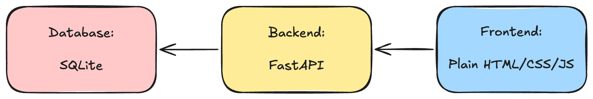
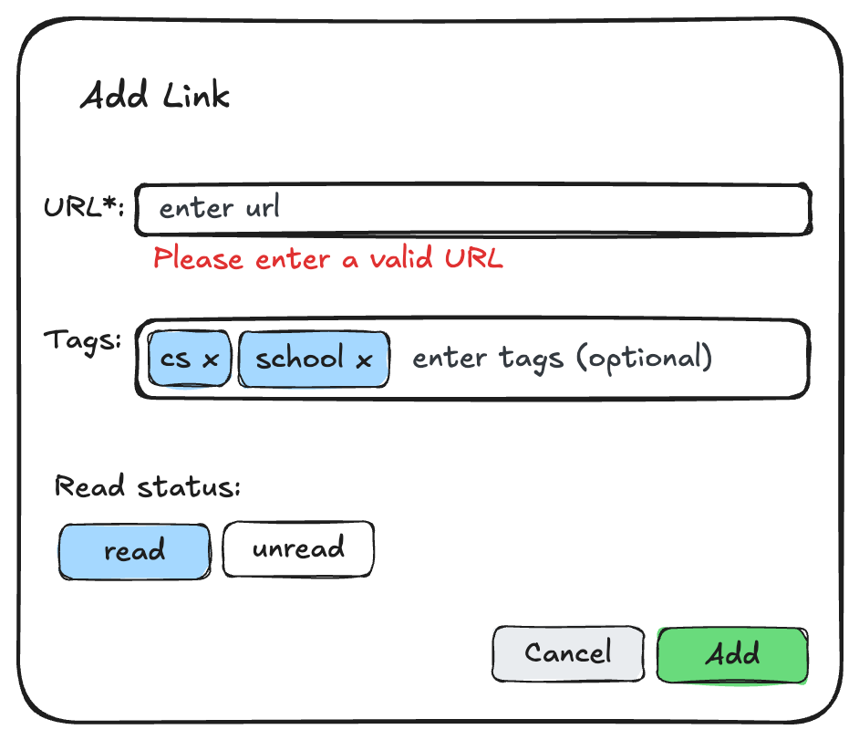

## Tech Stack

- **Frontend:** Plain HTML/CSS/JS
- **Backend:** FastAPI
- **Database:** SQLite


## Data Model

This represents a single link saved by a user.


| Field Name | Data Type |
| --- | --- | 
| `id` | int |
| `url` | String | 
| `title` | String | 
| `tags` | String Array | 
| `status` | String |
| `date` | Date |


## API Endpoints

- ### POST /api/links
    - **Example Request:**
    ```json
    {
    "url": "https://example.com",
    "tags": ["documentation", "learning"],
    "status": "unread"
    }
    ```
    - **Response:**
    ```json
    {
    "id": 1,
    "url": "https://example.com",
    "title": "Example Domain",
    "tags": ["documentation", "learning"],
    "status": "unread",
    "date": "2026-05-27T16:00:00Z"
    }
    ```

- ### GET /api/links
    - **Parameters (if filter by tags):** `?status=unread&tag=learning`
    - **Example Response:**
    ```json
    [
        {
        "id": 1,
        "url": "https://example.com",
        "title": "Example Domain",
        "tags": ["documentation", "learning"],
        "status": "unread",
        "date": "2026-05-27T23:00:00Z"
        }
    ]
    ```

- ### PATCH /api/links/:id
    - **Example Request:** 
    ```json
    {
        "status": "read",
        "title": "Updated Custom Title"
    }
    ```

- ### DELETE /api/links/:id

## SQL Queries for API Endpoints

- ### Post
```sql
INSERT INTO links (url, title, tags, read_status, date) 
VALUES (?, ?, json(?), ?, CURRENT_TIMESTAMP)
RETURNING *;
```

- ### Get
```sql
SELECT * FROM links 
WHERE read_status = 'unread' 
  AND EXISTS (
      SELECT 1 FROM json_each(tags) WHERE value = 'learning'
  );
```

- ### Patch
```sql
UPDATE links 
SET read_status = ?, title = ? 
WHERE id = ?
RETURNING *;
```

- ### Delete
```sql
DELETE FROM links 
WHERE id = ?;
```

## Architecture Diagram



## Submission Form Sketch


