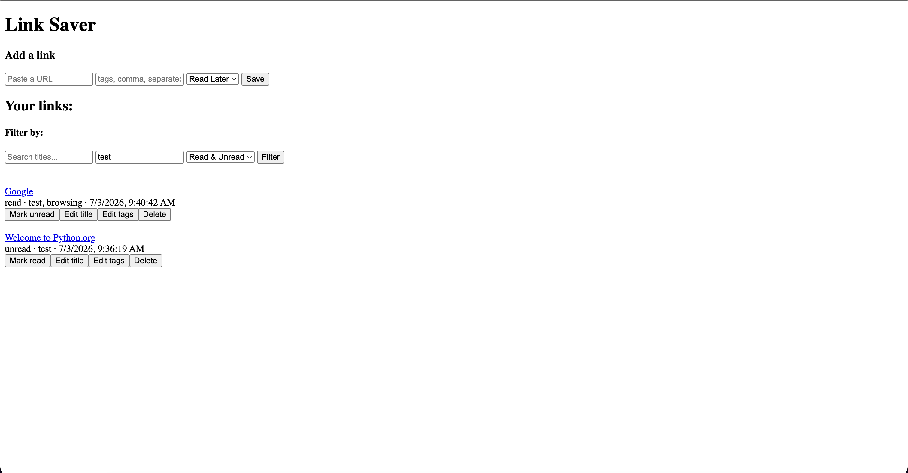

### TC-001: Happy Path

* **Description:** Verify link creation with all valid fields
* **Preconditions:**
    1. The link has not already been added
    2. No invalid fields (url, tags, status)
* **Test Steps:**
    1. Enter valid url ("https://python.org")
    2. Enter valid tags ("test")
    3. Enter valid status ("unread")
    4. Save link
* **Expected Result:**
    Status code: 200
    ```json
    {
        "id": 1,
        "url": "https://python.org",
        "title": "Welcome to Python.org",
        "tags": ["test"],
        "status": "unread",
        "date": "the current datetime string"
    }
    ```
* **Actual Result:** 
    Status code: 200
    ```json
    {
        "id": 1,
        "url": "https://python.org",
        "title": "Welcome to Python.org",
        "tags": [
        "test"
        ],
        "status": "unread",
        "date": "2026-07-03T02:36:19.628946+00:00"
    }
    ```

### TC-002: Multiple tags

* **Description:** Link creation with multiple tags
* **Preconditions:**
    1. The link has not already been added
    2. No invalid fields (url, tags, status)
* **Test Steps:**
    1. Enter valid url ("https://google.com")
    2. Enter valid tags, comma-separated ("test, browsing")
    3. Enter valid status ("read")
    4. Save link
* **Expected Result:**
    Status code: 200
    ```json
    {
        "id": 2,
        "url": "https://google.com",
        "title": "Google",
        "tags": ["test", "browsing"],
        "status": "read",
        "date": "the current datetime string"
    }
    ```
* **Actual Result:** 
    Status code: 200
    ```json
    {
        "id": 2,
        "url": "https://google.com",
        "title": "Google",
        "tags": [
        "test",
        "browsing"
        ],
        "status": "read",
        "date": "2026-07-03T02:40:42.825376+00:00"
    }
    ```

### TC-003: Empty URL

* **Description:** Link creation with empty URL
* **Test Steps:**
    1. Leave URL field empty
    2. Save link
* **Expected Result:**
    Browser alerts "Please enter a URL"
* **Actual Result:** 
    Browser alerts "Please enter a URL"

### TC-004: Duplicate URL

* **Description:** Link creation with URL that's already in database
* **Test Steps:**
    1. Enter duplicate URL ("https://python.org")
    2. Save link
* **Expected Result:**
    409 Conflict
    Browser alerts "This URL already exists"
* **Actual Result:** 
    409 Conflict
    Browser alerts "This URL already exists"

### TC-005: Edit title, tag, status

* **Description:** Edit an existing link's title, tag, and status
* **Preconditions:**
    1. The link exists
* **Test Steps:**
    1. Edit the link's fields with new values
* **Before Patch:**
    ```json
    {
        "id": 3,
        "url": "https://youtube.com",
        "title": "Youtube",
        "tags": [],
        "status": "unread",
        "date": "the current datetime string"
    }
    ```
* **Actual Result:** 
    Status code: 200
    ```json
    {
        "id": 3,
        "url": "https://Youtube.com",
        "title": "Watch Youtube",
        "tags": [
        "entertainment"
        ],
        "status": "read",
        "date": "2026-07-03T03:04:48.375217+00:00"
    },
    ```

### TC-006: Filter by tags

* **Description:** App should only list only links with the entered tags
* **Test Steps:**
    1. Enter tag filter "test"
    2. Click filter
* **Expected Result:**
    Show only links with the "test" tag, so Google and Python
* **Actual Result:** 
    

### TC-007: Full lifecycle test automated with pytest in /backend/test_api.py